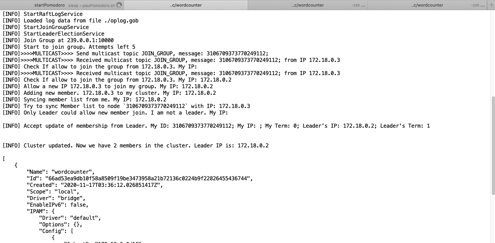
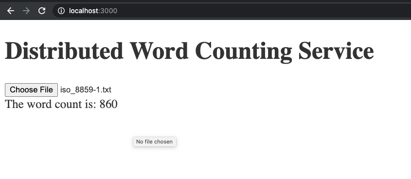
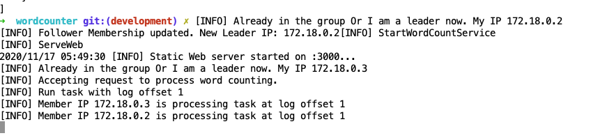

# Raft-like distributed Word Counter with Golang

- The project offers a basic framework for creating a high available service cluster to perform word counting

# Raft High Availability Workflow

## Clustering

- On node startup, it will send UDP packages to multicast address `239.0.0.1:10000` (configurable) to its network to detect if any leader node exists. If a leader node exists, it will join its cluster

## Leader election

- All followers will listen the leader's heartbeat over multicast address.
- If a follower _didn't_ receive a leader heartbeat within a time interval (randomly generated within [1000, 2000] milliseconds), it will send `Leader election` message into the multicast address to start a `new term` leader election
- A node always maintains a log stack and a term
- Leader node would be elected with 2 considerations: term ID, log offset
- Only the node with latest log offset has the potential to be elected as the new term leader
- A follow could only vote for a leader candidate for a term
- A potential leader candidate has to a win majority vote (more than a half of the members) to become a new leader

## Service/Operation flow

- Any operation request will be persisted into the log stack in the local drive and propagated into the cluster before proceeding.
- The leader node is in charge of log persisting and syncing.
- Once the operation log are safely saved and synced, any node, including followers and the leader, could orchestrate the cluster to perform actions against any corresponding log offset. So, all nodes could offer HTTP services to any users.
- The HTTP service run at port `3000` in all nodes.

# Example: Word counting workflow

- User submits a text file from browser at address `http://NODE_IP:3000`
- The node received the text file will request leader node over `go-rpc` to save its bytes into log stack
- The node then coordinates the cluster to count the words, also via `go-rpc`
- Any nodes in the cluster will receive an offset and a length to count. So that they will count the file in the distributed manner. The file results will be accumulated by the node serving the HTTP request and then send back to the browser
- The browser will show the final result

# Usage

## Deploy with Docker containers

- call `./bin/dockerrun.sh 2` to start a 2-member docker container cluster (change 2 to N for N-member cluster)
- Open `http://ANY_DOCKER_CONTAINER_IP:3000` in Chrome
  - `ANY_DOCKER_CONTAINER_IP` is the IP of any members in the cluster that is accessible
  - In the docker cluster started by `./bin/dockerrun.sh`, we only expose port `3000` of the first container to its host at `http://localhost:3000/`
- Upload a text file and view the result in the browser

## Deploy in cloud computing instances

- Build the package for the target cloud OS
- Upload the generated binary file into cloud computing instances, like EC2 Ubuntu instances
- Make sure all the instances share the same VPC network
- Run the binary in each instances
- Use any main stream browser to open `http://ANY_NODE_PUBLIC_IP:3000`

# Screenshots

- Leader election and clustering
  

- Offer HTTP service at port 3000
  

- The cluster members work on a task together to generate the final output
  

# Credits & References

- http://www.steves-internet-guide.com/introduction-multicasting/
- https://github.com/dmichael/go-multicast
- https://medium.com/rungo/building-rpc-remote-procedure-call-network-in-go-5bfebe90f7e9
- https://tutorialedge.net/golang/go-file-upload-tutorial/
